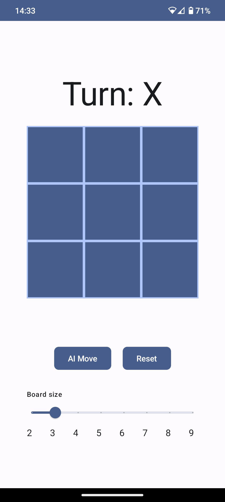
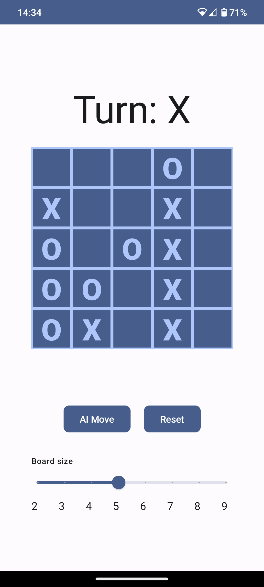
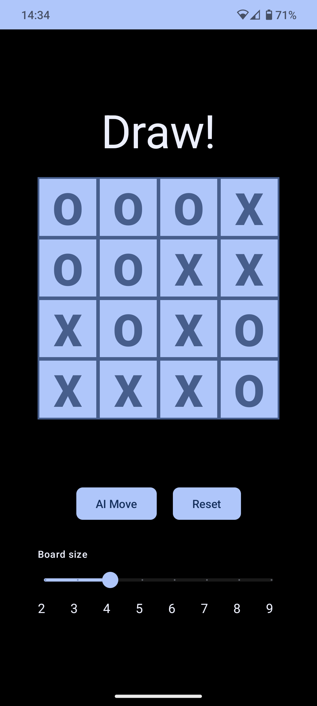

# TicTacYou

TicTacYou is a Tic-Tac-Toe game built with Material Design 3 and Jetpack Compose. It offers a customizable gameplay experience with variable board sizes and challenging AI opponents.

## Features

- **Material Design 3**: TicTacYou embraces the latest design principles, providing a sleek and visually appealing user interface.

- **Jetpack Compose**: Built entirely with Jetpack Compose, TicTacYou takes advantage of its declarative UI framework for efficient and flexible UI development.

- **Variable Board Size:** Customize the game by choosing the size of the game board, ranging from 2x2 to 9x9, providing a dynamic and challenging gameplay experience. The interactive slider offers an intuitive way to adjust the board size, with visual feedback and step labels for precise control.

- **AI Moves:** Challenge yourself against an intelligent AI opponent powered by a Min-Max algorithm with Alpha-Beta pruning. The AI algorithm analyzes the game state, strategically searching and selecting the best possible move to maximize its chances of winning. It adapts its gameplay strategy based on the board size, providing a formidable opponent in every game. Additionally, when playing on a board size larger than 5x5, TicTacYou proactively warns users about potential longer AI move calculation times. It offers the option to proceed or cancel, ensuring a seamless and informed gaming experience.

- **Responsive UI**: The UI adapts fluidly to different screen sizes and orientations, ensuring a consistent and enjoyable experience on various devices.

## Screenshots

